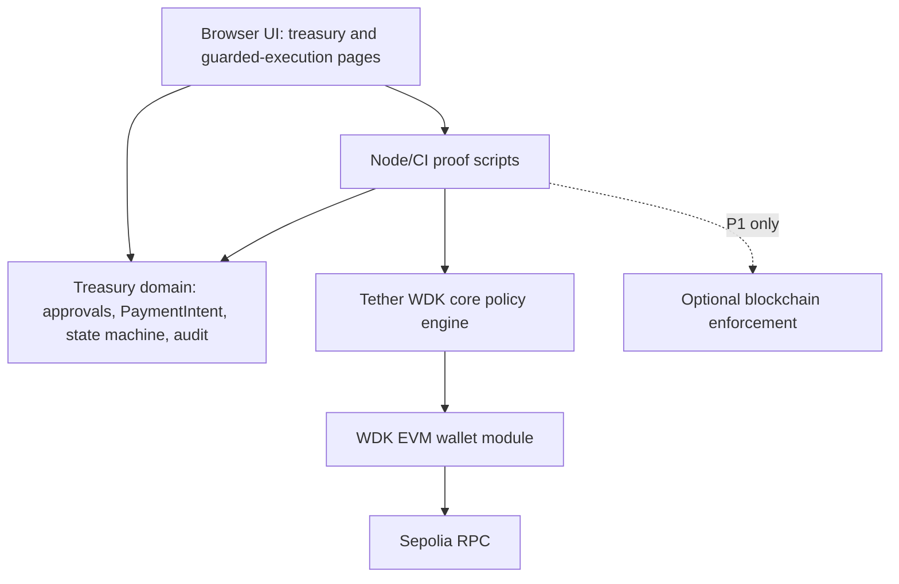
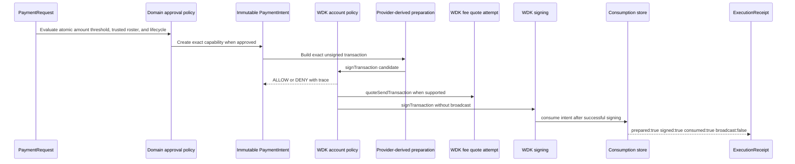
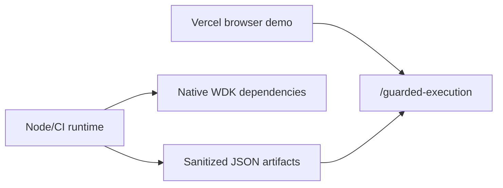
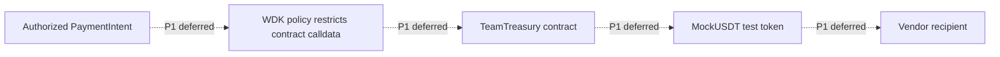

# CupTreasury Architecture

CupTreasury is a football treasury demo with a Node/CI WDK proof path. The browser does not execute native WDK wallet operations. The browser visualizes a sanitized proof generated by the Node policy demo.

## Deterministic local contract proof

The final proof adds an ephemeral Hardhat chain (ID `31337`). A local-only MockUSDT contract and TeamTreasury contract are deployed with fresh WDK Captain/Treasurer accounts. WDK signs both approvals and the exact `executeRequest(0)` call. TeamTreasury stores the canonical PaymentIntent hash, transfers `120000000` atomic MockUSDT only after both approvals, and rejects a second contract execution. The browser renders the sanitized generated artifact; it does not execute WDK.

## System Layers

## Payment Request To Receipt

## Runtime Boundaries

## Optional Contract Flow

The optional contract phase is not implemented in this branch. The mandatory WDK path is prioritized and tested.

## Tether Components Used

### WDK Core

Package: `@tetherto/wdk@1.0.0-beta.13`

Why selected: WDK core provides wallet registration, account derivation, local transaction policy registration, default-deny account proxies, and runtime policy simulation.

How implemented: `createTreasuryWdk()` creates an ephemeral WDK instance, registers the EVM wallet, registers an account-scoped policy, derives account index `0`, and disposes the WDK instance after proof generation.

Trade-off: Policy conditions are application-owned JavaScript predicates. CupTreasury must maintain durable PaymentIntent state and exact matching itself.

### WDK EVM Wallet Module

Package: `@tetherto/wdk-wallet-evm@1.0.0-beta.15`

Why selected: CupTreasury targets an EVM treasury flow and needs provider-derived EVM transaction fields, ERC-20 calldata, WDK fee-quote attempts, and no-broadcast transaction signing.

How implemented: The proof prepares ERC-20 `transfer(address,uint256)` calldata, derives nonce, gas, fee fields, and chain id from the configured provider, dry-runs the exact candidate through WDK `account.simulate.signTransaction(...)`, attempts `quoteSendTransaction`, and signs through `signTransaction` without broadcasting. The placeholder token has no bytecode and is explicitly marked `missing-contract`.

Trade-off: There is no public `prepareTransaction` API in this beta, so CupTreasury prepares the deterministic unsigned transaction in its adapter and clearly labels that as app-level preparation.

### WDK Transaction Policy System

Package: `@tetherto/wdk@1.0.0-beta.13`

Why selected: It is the differentiator for this semifinal submission. An approved expense becomes an exact WDK-governed signing capability.

How implemented: `createPaymentIntentPolicy()` registers a default-deny account-scoped policy. The ALLOW rule matches only the exact prepared transaction for the immutable PaymentIntent, calls the injected clock on each evaluation, and checks the application consumption store. Non-executable lifecycle states are explicitly denied. The ALLOW rule does not bypass broader project DENY policies.

Trade-off: Quote methods are read-only and not policy-wrapped, so CupTreasury evaluates WDK policy before quoting.

## Important Files

- `src/domain/treasury/**`: React-independent treasury domain model.
- `src/lib/wdk/guarded/**`: WDK guarded execution adapter.
- `scripts/wdk-policy-demo.ts`: Judge-readable ALLOW/DENY proof script.
- `src/app/guarded-execution/page.tsx`: Browser visualization of the sanitized proof.
- `.github/workflows/ci.yml`: CI proof reproduction and artifact upload.
